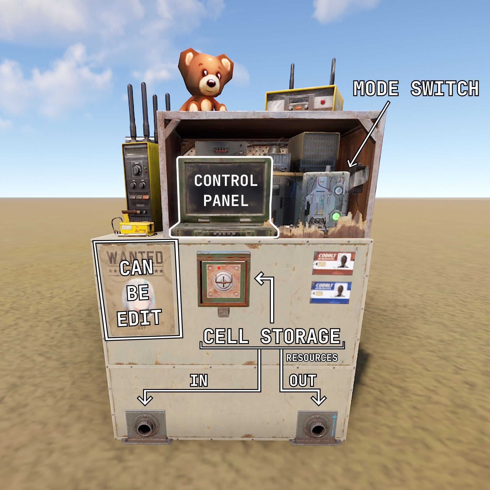
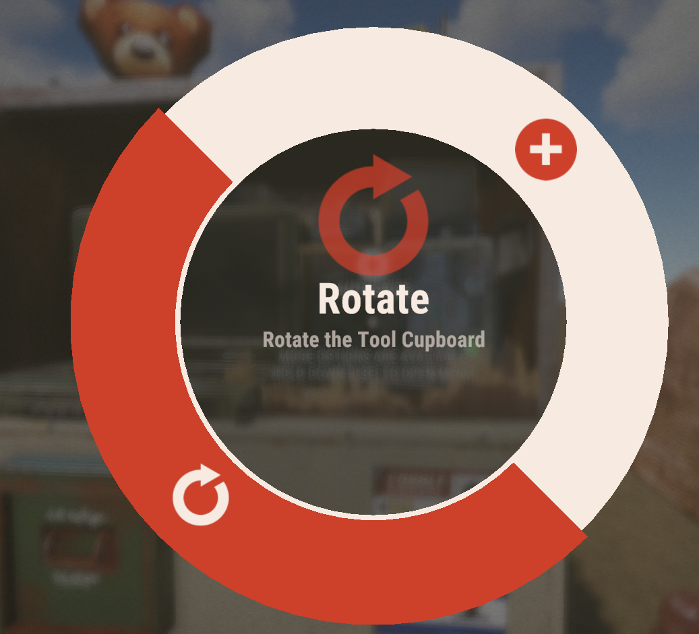
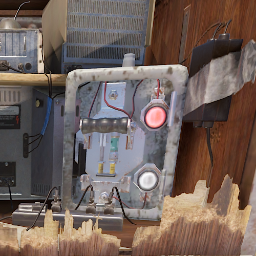
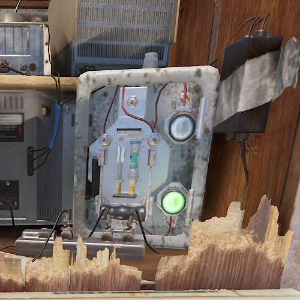
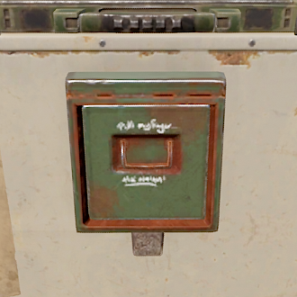

## Terminal
The Terminal is a powerful and interactive tool that allows players to manage all of their base resources from a single location. Rather than being a simple menu or on-screen button, it functions as a fully placeable item that can be installed inside your base, creating a much more immersive and engaging experience.

Its versatility makes it useful for a wide range of applications, whether you're simply organizing and monitoring your resources or designing an entire automated resource production system centered around the Terminal itself. With plenty of functionality and customization options, it can become a key part of any player's base setup.

Let's take a closer look at what it can do.

## Obtaining The Terminal
The Terminal can be obtained by selecting this as a Prestige Perk only within the server.

Once you have selected the reward for your Prestige Perk you can then obtain the Terminal by utilizing either "/kit" or by purchasing the item via "/s" and locating it under the Prestige category on the Stock Market.

## Features and Usage
The Terminal is designed to give players complete control over their base operations through a single, easy-to-use interface. Monitor resource levels, manage connected systems, automate production workflows, and streamline day-to-day base management without constantly moving between storage containers and machines.

Whether you're a casual player looking for a more organized base or an advanced builder creating a fully automated production network, the Terminal provides the tools needed to centralize and simplify resource management. Its modular design and extensive functionality make it a valuable addition to any base, regardless of size or playstyle.

### Examples of Uses
- Access and manage resources remotely from a single interface, allowing you to withdraw from and deposit into multiple storage containers simultaneously.
- Use the Terminal as a centralized storage hub, effectively combining multiple connected containers into one large inventory system.
- Utilize import and export pipe connections to automatically move resources between storage and production equipment.
- Design and operate fully automated production facilities powered entirely through the Terminal network.
- Create advanced logistics systems, such as resource buffer chests and distribution hubs, to optimize storage and production efficiency.
- Combine multiple Terminal functions together to develop unique automation setups tailored to your base's needs.

### Key Features
- Automatically combines identical item types into a single inventory slot, displaying the total quantity available while allowing precise withdrawal amounts.
- Supports both Wireless and Cellular operating modes, providing flexible access options for different base setups.
- Functions as a fully featured, placeable in-game object rather than a simple UI menu, creating a more immersive player experience.
- Fully compatible with Rust's industrial piping system, enabling seamless resource automation and transportation.
- Create and manage multiple storage cells, with four upgrade levels available by default.
- Each storage cell has its own dedicated capacity and stack-size limitations, allowing for scalable storage expansion.
- Intelligent item handling prevents containers from exceeding their configured storage limits, ensuring resources remain organized and properly distributed.

## How to Use / Common Questions

### Retrieving/Picking Up Your Terminal
Before a Terminal can be picked up, the player must have Tool Cupboard authorization.

With a Building Hammer equipped, aim at the section of the Terminal displaying the Authorize prompt. Press R to open the available options and select Turn. The Terminal will then be ready to be collected.

### Switching Between Operating Modes

To change the Terminal's operating mode, locate the switch on the right side of the laptop and interact with it. Each press will cycle through the available modes.

The switch is shown below:

- Red light is Wireless Mode
- Green light is Cell Mode

### Using Wireless Mode

Getting started with Wireless Mode is simple.

First, ensure the Terminal is set to Wireless Mode by using the mode switch located on the right side of the laptop.

Once connected to the Terminal, locate the toggle button next to the storage boxes displayed in the center of the interface and enable it. This will allow the Terminal to display the contents of all connected storage containers within range.

After enabling the toggle, you will be able to view and manage the resources stored in nearby containers directly through the Terminal interface, providing quick and convenient access to your base's inventory from a single location.

### What Are Storage Cells and How Do They Work

Storage Cells are designed to provide significantly more storage capacity than standard containers by utilizing enhanced stacking mechanics.

Each Storage Cell has a set number of available slots and a maximum stack size per slot. Unlike regular storage containers, these special slots allow items to stack up to the cell's configured limit.

The system operates on a one item type per slot basis. For example, if a Storage Cell supports a stack size of 5,000 and you place 10 Assault Rifles into it, they will occupy a single slot. You can continue adding identical Assault Rifles to that same slot until the stack reaches 5,000. However, if you add an Assault Rifle with different durability, it will be stored in a separate slot, as the item is considered unique.

This behavior applies to all item types stored within a Storage Cell.

A Level 1 Storage Cell contains:

- 8 Storage Slots
- Maximum Stack Size: 5,000 per slot

If you choose to store only Sulfur Ore, each slot can hold up to 5,000 Sulfur, allowing the cell to store a total of 40,000 Sulfur Ore.

Higher-tier Storage Cells provide additional slots and larger stack capacities, dramatically increasing the total amount of resources that can be stored.

**Important Note**

The enhanced stack sizes exist only while items are stored inside a Storage Cell. When items are withdrawn or transferred out, they automatically return to their normal Rust stack limits. Likewise, items placed into a Storage Cell will automatically combine into the configured storage stacks whenever possible

### Using Cell Mode

To use Cell Mode, you will first need to obtain Storage Cells. These can be found throughout the world as loot and rewards from various activities, including Bradleys, Helis, raids, and other high-value events.

Once you have acquired a Storage Cell, place it into the Terminal's dedicated Cell Storage compartment. As shown below:

Next, switch the Terminal to Cell Mode using the mode selector located on the right side of the laptop.

After opening the Terminal interface, you will be able to view all installed Storage Cells, monitor their available capacity, browse stored items, and transfer resources directly to and from the cells through the Terminal.

@[youtube](https://www.youtube.com/watch?v=4usFBBkQaSc){width=960 height=540}

@[youtube](https://www.youtube.com/watch?v=1NY6LnrJSNU){width=960 height=540}